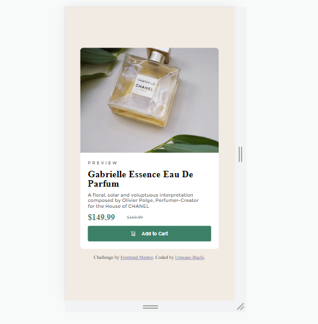

# Frontend Mentor - Product preview card component solution

This is a solution to the [Product preview card component challenge on Frontend Mentor](https://www.frontendmentor.io/challenges/product-preview-card-component-GO7UmttRfa). Frontend Mentor challenges help you improve your coding skills by building realistic projects.

## Table of contents

- [The challenge](#the-challenge)
- [Screenshot](#screenshot)
- [What I learned](#what-i-learned)
- [Useful resources](#useful-resources)
- [Author](#author)
- [Acknowledgments](#acknowledgments)

### The challenge

Users should be able to:

- View the optimal layout depending on their device's screen size
- See hover and focus states for interactive elements

### Screenshot

### What I learned

Positioning the flexbox and div's were really tricky. It took me a while to find a suitable solution, i still hope to improve my skills.

### Useful resources

- (https://www.youtube.com/watch?v=XghPJQ1Oeks) - This helped when i got stuck during positioning. I really liked this solution.

## Author

- Frontend Mentor - [@B-uchi](https://www.frontendmentor.io/profile/B-uchi)
- Twitter - [@yo-itz-buchi](https://www.twitter.com/yo-itz-buchi)

## Acknowledgments

Credits to Irvine mesa (https://www.youtube.com/c/IrvineMesa) for his flexbox solution.
